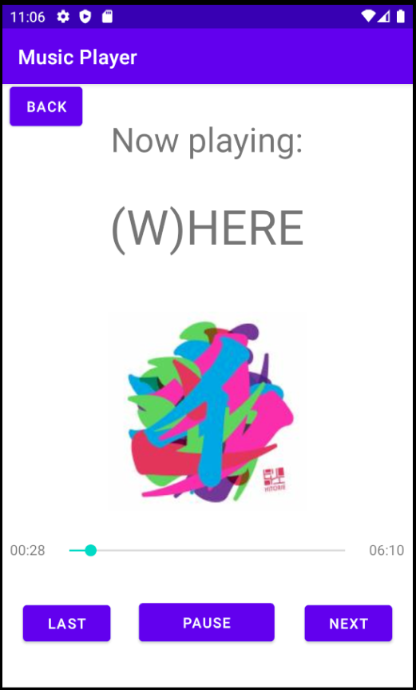
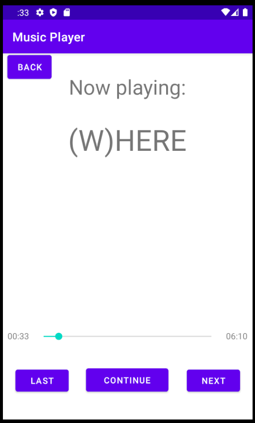

# Android-Music-Player-APP

A simple music player

My groupmate and I developed a simple music player application for Android that plays music stored on the device.

The main menu displays a list of music files. When the user clicks on a music file name, the application starts the music play activity to play the music.

The music playing layout displays the music's name and its album picture. There are also three buttons: play/pause, last, and next

I added a new button that allows the user to listen to the music in random order. The user can switch to the random play mode or return to normal mode by clicking on this button.

